# GoMuseum CI/CD 配置指南

## 🎯 概述

GoMuseum项目采用**渐进式开发模式**，通过9个步骤逐步构建完整的智能博物馆导览应用。每个步骤都有独立的CI/CD流程，支持并行开发和独立部署。

## 📋 项目结构

```
GoMuseum/
├── .github/workflows/          # CI/CD配置文件
│   ├── ci-cd-step1.yml        # Step 1: 项目初始化
│   ├── ci-cd-step2.yml        # Step 2: 识别功能
│   ├── ci-cd-step3.yml        # Step 3: 缓存系统
│   ├── ci-cd-step4.yml        # Step 4: 讲解生成
│   ├── ci-cd-step5.yml        # Step 5: UI完善
│   ├── ci-cd-step6.yml        # Step 6: 错误处理
│   ├── ci-cd-step7.yml        # Step 7: 多级缓存优化
│   ├── ci-cd-step8.yml        # Step 8: 离线包功能
│   └── ci-cd-step9.yml        # Step 9: 支付集成
├── gomuseum_api/              # FastAPI 后端
├── gomuseum_app/              # Flutter 前端
├── docker/                    # Docker配置
├── scripts/                   # 部署和工具脚本
└── .env.example               # 环境变量模板
```

## 🚀 9步骤开发计划

| Step | 功能模块 | 主要特性 | 预估时间 | 状态 |
|------|----------|----------|----------|------|
| 1 | **项目初始化** | 基础架构、Docker化 | 1个周期 | ✅ 已配置 |
| 2 | **识别功能** | AI视觉识别、图片处理 | 1-2个周期 | ✅ 已配置 |
| 3 | **缓存系统** | Redis、SQLite多级缓存 | 1个周期 | ✅ 已配置 |
| 4 | **讲解生成** | AI内容生成、多语言 | 1个周期 | ✅ 已配置 |
| 5 | **UI完善** | Flutter界面、用户体验 | 1-2个周期 | ✅ 已配置 |
| 6 | **错误处理** | 异常处理、性能优化 | 1个周期 | ✅ 已配置 |
| 7 | **多级缓存优化** | 智能缓存、预测加载 | 1个周期 | ✅ 已配置 |
| 8 | **离线包** | 离线数据、增量更新 | 1个周期 | ✅ 已配置 |
| 9 | **支付集成** | IAP、订阅、5次免费 | 1个周期 | ✅ 已配置 |

## 🔧 GitHub Secrets 配置

在GitHub仓库设置中配置以下密钥：

### 必需的Secrets
```bash
# AI服务
OPENAI_API_KEY=sk-your-openai-api-key

# Docker Hub
DOCKER_USERNAME=your-docker-username
DOCKER_PASSWORD=dckr_pat_your-access-token

# 可选的Secrets
CLAUDE_API_KEY=your-claude-api-key
CODECOV_TOKEN=your-codecov-token
```

### 配置步骤
1. 进入仓库 Settings → Secrets and variables → Actions
2. 点击 "New repository secret"
3. 添加上述密钥

## 🌿 分支管理策略

### 分支结构
```
main                 # 生产环境 (手动部署)
├── develop          # 开发主分支 (自动部署到dev)
├── step-1-*         # Step 1 功能分支
├── step-2-*         # Step 2 功能分支
├── step-3-*         # Step 3 功能分支
...
└── step-9-*         # Step 9 功能分支
```

### 分支命名规范
```bash
# 功能开发分支
step-{N}-{feature-name}

# 示例
step-1-initial-setup
step-2-recognition-api
step-3-redis-cache
step-4-ai-explanation
step-5-flutter-ui
step-6-error-handling
step-7-cache-optimization
step-8-offline-packages
step-9-payment-system
```

## 🔄 CI/CD 工作流程

### 1. 触发条件

每个步骤的CI/CD会在以下情况触发：

```yaml
# 推送到对应分支
push:
  branches: [ step-N-*, develop ]

# 创建PR到develop或main
pull_request:
  branches: [ develop, main ]

# 手动触发
workflow_dispatch:
```

### 2. 构建流程

每个步骤包含以下阶段：

```mermaid
graph LR
    A[代码检查] --> B[API测试]
    B --> C[Flutter测试]
    C --> D[Docker构建]
    D --> E[集成测试]
    E --> F[部署dev]
    F --> G[性能测试]
    G --> H[生成报告]
```



### 3. 环境部署

| 环境 | 分支 | 部署方式 | URL |
|------|------|----------|-----|
| 开发环境 | develop | 自动部署 | https://dev.gomuseum.com |
| 测试环境 | step-*-* | 自动部署 | https://test.gomuseum.com |
| 生产环境 | main | 手动触发 | https://api.gomuseum.com |

## 📝 开发工作流程

### 开始新的步骤开发

1. **创建功能分支**
   ```bash
   # 从develop分支创建
   git checkout develop
   git pull origin develop
   git checkout -b step-3-redis-cache
   ```

2. **开发功能**
   ```bash
   # 编写代码
   # 运行本地测试
   flutter test              # Flutter测试
   pytest tests/             # API测试 (in gomuseum_api/)
   ```

3. **提交代码**
   ```bash
   git add .
   git commit -m "feat: Step 3 - 实现Redis缓存系统"
   git push origin step-3-redis-cache
   ```

4. **CI/CD自动触发**
   - GitHub Actions自动运行对应的CI/CD流程
   - 检查构建状态和测试结果

5. **创建Pull Request**
   ```bash
   # 使用GitHub CLI或web界面
   gh pr create --title "Step 3: Redis缓存系统" --body "实现多级缓存架构"
   ```

### 合并到开发分支

1. **代码审查通过后合并**
   ```bash
   git checkout develop
   git merge step-3-redis-cache
   git push origin develop
   ```

2. **自动部署到开发环境**
   - CI/CD自动部署到 dev.gomuseum.com
   - 运行集成测试和性能测试

## 🧪 测试策略

### 测试层级

1. **单元测试**
   ```bash
   # API测试
   cd gomuseum_api
   pytest tests/ -v --cov=app

   # Flutter测试  
   cd gomuseum_app
   flutter test
   ```

2. **集成测试**
   - API端点测试
   - 数据库集成测试
   - AI服务集成测试

3. **性能测试**
   - 响应时间监控
   - 并发负载测试
   - 内存使用分析

### 测试数据

使用模拟数据进行测试：
```yaml
# 测试环境变量
TEST_DATABASE_URL=sqlite:///./test.db
TEST_REDIS_URL=redis://localhost:6379/1
MOCK_AI_RESPONSES=true
```

## 🐳 Docker 部署

### 构建镜像

CI/CD自动构建Docker镜像：
```bash
# 镜像命名规范
docker.io/your-username/gomuseum-api:step-N-latest
docker.io/your-username/gomuseum-api:step-N-{build-number}
```

### 本地测试
```bash
# 构建镜像
docker build -t gomuseum-api:local -f docker/Dockerfile.api .

# 运行容器
docker run -p 8000:8000 \
  -e OPENAI_API_KEY=your-key \
  -e DATABASE_URL=sqlite:///./app.db \
  gomuseum-api:local
```

## 📊 监控和日志

### 构建状态监控

在GitHub仓库中查看：
- Actions页面显示所有CI/CD状态
- 每个步骤的构建历史
- 测试覆盖率报告

### 性能指标

每个步骤会生成性能报告：
- API响应时间
- 测试覆盖率
- Docker镜像大小
- 部署成功率

## 🚨 故障排除

### 常见问题

1. **GitHub认证失败**
   ```
   Error: fatal: could not read Username for 'https://github.com'
   ```
   **解决方案**: 检查GitHub Secrets配置，确保GITHUB_TOKEN有正确权限

2. **Docker Hub推送失败**
   ```
   Error: denied: access forbidden
   ```
   **解决方案**: 验证DOCKER_USERNAME和DOCKER_PASSWORD配置

3. **OpenAI API调用失败**
   ```
   Error: Invalid API key
   ```
   **解决方案**: 检查OPENAI_API_KEY是否正确配置

### 调试步骤

1. **检查GitHub Actions日志**
   - 进入Actions页面
   - 点击失败的workflow
   - 查看详细错误信息

2. **本地复现问题**
   ```bash
   # 使用相同的环境变量
   export OPENAI_API_KEY=your-key
   
   # 运行相同的命令
   pytest tests/ -v
   ```

3. **检查依赖版本**
   ```bash
   # 检查Python依赖
   pip list
   
   # 检查Flutter依赖
   flutter doctor -v
   ```

## 🔄 手动触发部署

在GitHub仓库Actions页面：

1. 选择对应的workflow
2. 点击 "Run workflow"
3. 选择分支和环境
4. 点击 "Run workflow" 按钮

## 📈 开发进度追踪

### 步骤完成标志

每个步骤完成时会：
- ✅ 所有测试通过
- ✅ Docker镜像构建成功
- ✅ 部署到开发环境成功
- ✅ 性能测试达标
- ✅ 生成步骤报告

### 项目里程碑

- **Week 1-2**: Steps 1-6 (MVP功能)
- **Week 3-4**: Steps 7-9 (优化和付费)
- **Week 5**: 集成测试和生产部署

## 🤝 团队协作

### 代码审查

每个PR需要：
- 至少1个审查者批准
- 所有CI检查通过
- 冲突解决
- 更新文档

### 并行开发

不同团队成员可以并行开发不同步骤：
```bash
# 开发者A: Step 3缓存系统
git checkout -b step-3-caching

# 开发者B: Step 4讲解生成  
git checkout -b step-4-explanation

# 开发者C: Step 5界面优化
git checkout -b step-5-ui-polish
```

## 📚 参考资源

- [项目架构文档](gomuseum-docs/Arch-Design/gomuseum-architecture-complete.md)
- [Claude Code实施指南](gomuseum-docs/Arch-Design/claude-code-implementation-guide.md)
- [产品需求文档](gomuseum-docs/2%20-%20产品需求文档.md)
- [GitHub Actions文档](https://docs.github.com/en/actions)
- [Docker最佳实践](https://docs.docker.com/develop/dev-best-practices/)

## 🎯 下一步

1. **验证CI/CD配置**: 推送到step-1-*分支测试
2. **配置GitHub环境**: 设置staging和production环境
3. **监控设置**: 配置Sentry、Grafana等监控工具
4. **团队培训**: 确保所有开发者了解工作流程

---

**最后更新**: $(date)  
**文档版本**: v1.0  
**维护者**: GoMuseum开发团队