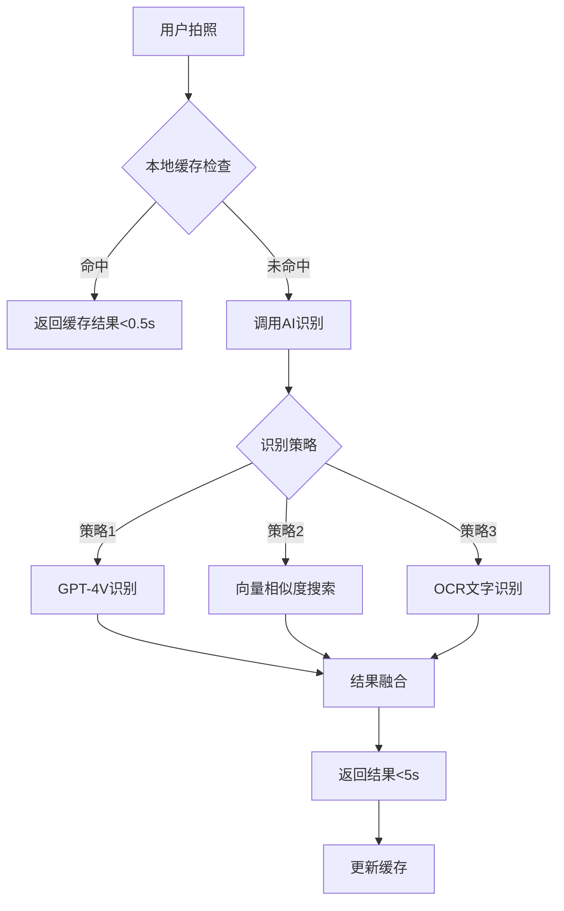
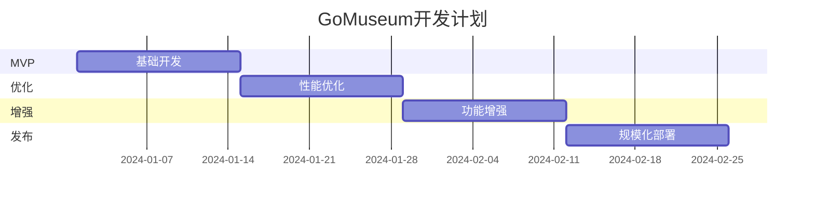

# GoMuseum 完整产品架构文档 v1.2

## 使用说明
```markdown
本文档配合《Claude Code实施指南》使用：
1. 本文档：提供完整技术规范和设计细节
2. 实施指南：提供分步骤的开发指令和进度管理

开发流程：
- 每个开发Step开始前，从本文档复制相关章节
- 提供给Claude Code作为技术规范
- 然后执行实施指南中的具体指令
- Step 2后采用TDD（测试驱动开发）模式
```

## 目录
1. [产品概述](#1-产品概述)
2. [系统架构](#2-系统架构)
3. [核心功能模块](#3-核心功能模块)
4. [技术实现方案](#4-技术实现方案)
5. [数据架构](#5-数据架构)
6. [性能与并发](#6-性能与并发)
7. [成本优化](#7-成本优化)
8. [部署与运维](#8-部署与运维)
9. [实施路线图](#9-实施路线图)
10. [风险管理](#10-风险管理)
11. [附录](#11-附录)

---

## 1. 产品概述

### 1.1 产品定位
GoMuseum 是一款基于AI的智能博物馆导览应用，通过拍照识别、多语言讲解和AI问答，为游客提供个性化的博物馆参观体验。

### 1.2 核心价值
- **即拍即知**：5秒内完成展品识别和讲解
- **个性化体验**：根据用户偏好定制讲解内容
- **离线可用**：支持离线包下载，无网络也能使用
- **多语言支持**：覆盖6种主要语言

### 1.3 目标用户
- **主要用户**：博物馆游客（游客、学生、艺术爱好者）
- **使用场景**：博物馆参观、艺术学习、文化旅游
- **用户规模**：目标10万+日活用户

### 1.4 商业模式
```yaml
免费模式:
  - 5次免费识别额度
  - 基础讲解功能
  
付费模式:
  - 按次付费: €1.99/10次
  - 按天通行: €2.99-3.99/天
  - 年度订阅: €19.9/年
  
推荐奖励:
  - 被推荐人注册: 新用户+5次
  - 推荐人: 未订阅+5次；已订阅+1天使用权
```

---

## 2. 系统架构

### 2.1 总体架构图
```
┌─────────────────────────────────────────────────────────┐
│                    客户端层 (Flutter)                     │
├─────────────────────────────────────────────────────────┤
│   UI层 │ 业务逻辑层 │ 本地缓存 │ 离线包管理 │ 状态管理    │
└────────────────────┬───────────────────────────────────┘
                     │ HTTPS/WebSocket
┌────────────────────▼───────────────────────────────────┐
│                  API Gateway (Kong)                      │
│            限流 │ 认证 │ 路由 │ 缓存 │ 监控              │
└────────────────────┬───────────────────────────────────┘
                     │
┌────────────────────▼───────────────────────────────────┐
│                    微服务层                              │
├──────────┬──────────┬──────────┬──────────┬───────────┤
│ 用户服务  │ AI编排   │ 内容服务  │ 支付服务 │ 同步服务   │
│ Auth/User│AI Orchestra│ Content │ Payment │   Sync    │
└──────────┴──────────┴──────────┴──────────┴───────────┘
                     │
┌────────────────────▼───────────────────────────────────┐
│                  AI服务层                                │
├──────────┬──────────┬──────────┬──────────┬───────────┤
│ GPT-4V   │ GPT-4    │ TTS服务  │向量检索  │ 本地模型   │
│ 图像识别  │ 内容生成  │ 语音合成  │Pinecone │ Fallback │
└──────────┴──────────┴──────────┴──────────┴───────────┘
                     │
┌────────────────────▼───────────────────────────────────┐
│                   数据存储层                             │
├──────────┬──────────┬──────────┬──────────┬───────────┤
│PostgreSQL│  Redis   │   S3/OSS  │ Pinecone│ MongoDB  │
│ 业务数据  │ 缓存层   │  文件存储  │ 向量库   │ 日志数据  │
└──────────┴──────────┴──────────┴──────────┴───────────┘
```

### 2.2 技术栈选型

#### 前端技术栈
```yaml
框架: Flutter 3.x
状态管理: Riverpod 2.0
本地数据库: Drift (SQLite)
网络请求: Dio + Retrofit
图像处理: image_picker + camera
音频处理: just_audio + flutter_tts
依赖注入: get_it
路由管理: go_router
测试框架: flutter_test + mockito
```

#### 后端技术栈
```yaml
主框架: Python FastAPI / Node.js Express
数据库: PostgreSQL 14 + Redis 7
向量数据库: Pinecone / Qdrant
消息队列: RabbitMQ / AWS SQS
对象存储: AWS S3 / 阿里云OSS
容器化: Docker + Kubernetes
监控: Prometheus + Grafana
日志: ELK Stack
测试框架: pytest + pytest-asyncio
```

#### AI服务（支持动态切换）
```yaml
图像识别（可配置切换）:
  主选: ${AI_VISION_PRIMARY} # 环境变量配置
  备选: ${AI_VISION_BACKUP}
  
ai_models:
  vision:
    - provider: openai
      model: gpt-5-vision  # 假设GPT-5已发布
      cost_per_call: 0.05
      accuracy: 0.95
      enabled: true
    - provider: openai  
      model: gpt-4-vision-preview
      cost_per_call: 0.03
      accuracy: 0.90
      enabled: true
    - provider: anthropic
      model: claude-3-vision
      cost_per_call: 0.02
      accuracy: 0.88
      enabled: true
      
  strategy: "cost_optimized"  # balanced | accuracy_first | cost_optimized
```

---

## 3. 核心功能模块

### 3.1 拍照识别模块

#### 3.1.1 识别流程


#### 3.1.2 核心代码结构
```dart
class RecognitionService {
  // 混合识别策略
  Future<RecognitionResult> recognize(File image) async {
    // 1. 本地特征提取
    final features = await extractFeatures(image);
    
    // 2. 缓存查询
    final cached = await checkCache(features);
    if (cached != null) return cached;
    
    // 3. 云端识别（5秒超时）
    final result = await recognizeWithTimeout(image);
    
    // 4. 缓存结果
    await cacheResult(features, result);
    
    // 5. 预加载相关内容
    preloadRelated(result);
    
    return result;
  }
}
```

### 3.2 AI讲解生成

#### 3.2.1 内容生成策略
```python
class ExplanationGenerator:
    async def generate(self, artwork_id, preferences):
        # 1. 渐进式生成
        yield await self.get_basic_info(artwork_id)  # 立即返回
        
        # 2. 流式生成详细内容
        async for chunk in self.stream_detailed(artwork_id):
            yield chunk
            
        # 3. 生成语音（分句处理）
        audio_url = await self.generate_audio(text)
        yield {'audio_ready': audio_url}
```

#### 3.2.2 多语言支持
- 支持语言：EN/FR/DE/ES/IT/中文
- TTS音色：每种语言3-5种音色可选
- 内容本地化：考虑文化差异的讲解内容

### 3.3 离线包管理

#### 3.3.1 离线包结构
```json
{
  "museum_id": "louvre_001",
  "version": "2.0.1",
  "size_mb": 52,
  "content": {
    "metadata": "museum.json",
    "artworks": "artworks.db",
    "features": "embeddings.bin",
    "audio_cache": "tts_cache/",
    "images": "thumbnails/"
  }
}
```

#### 3.3.2 智能同步策略
```dart
class OfflinePackageManager {
  // 基于位置的智能下载
  Future<void> smartSync(Location location) async {
    // 获取附近博物馆
    final nearby = await getNearbyMuseums(location, radius: 5km);
    
    // 优先级排序
    final sorted = prioritize(nearby, factors: [
      'distance',
      'popularity', 
      'user_history'
    ]);
    
    // 后台下载前3个
    for (final museum in sorted.take(3)) {
      backgroundDownload(museum.packageUrl);
    }
  }
}
```

### 3.4 用户数据同步

#### 3.4.1 云同步架构
```yaml
同步策略:
  - 增量同步: 只传输变更数据
  - 冲突解决: 时间戳优先 + 合并策略
  - 加密传输: AES-256加密
  - 自动备份: 每日自动备份

数据范围:
  - 足迹记录
  - 收藏列表
  - 个人笔记
  - 偏好设置
  - 购买记录
```

#### 3.4.2 设备迁移
```dart
// 迁移流程
class DeviceMigration {
  // 旧设备导出
  Future<String> export() async {
    final data = await collectAllData();
    final code = generateMigrationCode();
    await uploadToTemp(code, data, ttl: 24h);
    return code; // 6位迁移码
  }
  
  // 新设备导入
  Future<void> import(String code) async {
    final data = await downloadFromTemp(code);
    await validateAndImport(data);
    await triggerCloudSync();
  }
}
```

---

## 4. 技术实现方案

### 4.1 AI模型适配器架构

#### 4.1.1 统一接口设计
```python
# ai_service/model_adapter.py
from abc import ABC, abstractmethod

class VisionModelAdapter(ABC):
    """视觉模型统一接口"""
    
    @abstractmethod
    async def recognize(self, image_data: bytes, **kwargs) -> Dict[str, Any]:
        pass
    
    @abstractmethod
    def get_cost(self) -> float:
        pass
    
    @abstractmethod
    def get_accuracy_score(self) -> float:
        pass

class OpenAIVisionAdapter(VisionModelAdapter):
    """OpenAI适配器（支持GPT-4V, GPT-5V等）"""
    
    def __init__(self, model_name: str):
        self.model_name = model_name
        self.cost_map = {
            'gpt-5-vision': 0.05,
            'gpt-4-vision-preview': 0.03,
            'gpt-4-turbo-vision': 0.02
        }
        self.accuracy_map = {
            'gpt-5-vision': 0.95,
            'gpt-4-vision-preview': 0.90,
            'gpt-4-turbo-vision': 0.85
        }
```

#### 4.1.2 智能模型选择器
```python
class ModelSelector:
    """根据策略动态选择最优模型"""
    
    def select_model(self, task_complexity: str, user_tier: str):
        if self.strategy == 'cost_optimized':
            return self._select_cheapest_adequate_model(task_complexity)
        elif self.strategy == 'accuracy_first':
            return self._select_most_accurate_model()
        else:  # balanced
            return self._select_balanced_model(task_complexity)
    
    def _select_balanced_model(self, complexity: str):
        """平衡成本和准确率"""
        def calculate_score(model):
            cost_score = 1.0 / (model.get_cost() + 0.01)
            accuracy_score = model.get_accuracy_score() * 100
            
            if complexity == 'simple':
                return cost_score * 0.7 + accuracy_score * 0.3
            elif complexity == 'complex':
                return cost_score * 0.3 + accuracy_score * 0.7
            else:
                return cost_score * 0.5 + accuracy_score * 0.5
        
        return max(self.models, key=calculate_score)
```

#### 4.1.3 动态配置
```yaml
# config/ai_models.yaml
ai_models:
  vision:
    - provider: openai
      model: gpt-5-vision  # 新模型
      cost_per_call: 0.05
      accuracy: 0.95
      enabled: ${ENABLE_GPT5:-false}
      
    - provider: openai
      model: gpt-4-vision-preview
      cost_per_call: 0.03
      accuracy: 0.90
      enabled: true
      
  strategy: ${AI_STRATEGY:-balanced}
  daily_budget: 100
  
  auto_switch:
    enabled: true
    rules:
      - condition: "cost > 80% of daily_budget"
        action: "switch_to_cheaper_model"
```

### 4.2 AI识别优化

#### 4.2.1 提示词工程
```python
RECOGNITION_PROMPT = """
You are an expert art historian. Analyze this museum artwork image.

Output JSON format:
{
  "artwork_name": "exact name",
  "artist": "artist name",
  "confidence": 0.0-1.0,
  "visual_features": ["key features"],
  "period": "art period/year",
  "museum_section": "location"
}

Prioritize text/labels if visible in image.
Be concise and accurate.
"""
```

#### 4.2.2 多级降级策略
```python
class FallbackStrategy:
    strategies = [
        (GPT4Vision, 3.0),      # 3秒超时
        (ClaudeVision, 2.0),    # 2秒超时
        (LocalModel, 1.0),      # 1秒超时
        (OCRMatching, 0.5),     # 0.5秒超时
        (ManualSearch, 0)       # 立即返回
    ]
    
    async def recognize(self, image):
        start = time.time()
        for strategy, timeout in self.strategies:
            remaining = 5.0 - (time.time() - start)
            if remaining < 0.5:
                break
            try:
                return await asyncio.wait_for(
                    strategy.process(image),
                    timeout=min(timeout, remaining)
                )
            except TimeoutError:
                continue
        return self.manual_fallback()
```

### 4.3 缓存策略

#### 4.3.1 多级缓存架构
```yaml
L1 - 设备本地缓存:
  存储: SQLite
  容量: 200MB
  命中延迟: <100ms
  
L2 - Redis缓存:
  存储: Redis Cluster
  容量: 10GB
  命中延迟: <500ms
  
L3 - CDN缓存:
  存储: CloudFlare
  容量: 无限
  命中延迟: <1s
```

#### 4.3.2 智能缓存管理
```dart
class CacheManager {
  // 缓存评分算法
  double calculateScore(CacheItem item) {
    final age = DateTime.now().difference(item.lastAccessed).inHours;
    final frequency = item.hitCount;
    final size = item.sizeKB;
    
    // 热门展品权重
    final popularity = item.isPopular ? 10.0 : 1.0;
    
    // 当前位置权重
    final proximity = item.museumId == currentMuseum ? 5.0 : 1.0;
    
    // 综合评分
    return (frequency * popularity * proximity) / 
           (age + 1) / log(size + 1);
  }
  
  // LRU + 评分的混合淘汰
  Future<void> evict() async {
    final items = await getAllItems();
    items.sort((a, b) => calculateScore(a).compareTo(calculateScore(b)));
    
    // 删除评分最低的20%
    final toRemove = items.take(items.length * 0.2);
    await removeItems(toRemove);
  }
}
```

### 4.4 性能优化

#### 4.4.1 预测性加载
```dart
class PredictiveLoader {
  Future<void> preload(String currentArtwork) async {
    // 基于多因素预测
    final predictions = await predict([
      NavigationModel(),     // 基于物理位置
      BehaviorModel(),       // 基于用户行为
      PopularityModel(),     // 基于热门度
    ]);
    
    // 按概率预加载
    for (final p in predictions.where((p) => p.probability > 0.3)) {
      if (p.probability > 0.7) {
        await preloadFull(p.artworkId);  // 完整预加载
      } else {
        await preloadBasic(p.artworkId); // 基础预加载
      }
    }
  }
}
```

#### 4.4.2 渐进式加载
```javascript
// 前端渐进式渲染
async function displayArtwork(artworkId) {
  // 1. 立即显示骨架屏
  showSkeleton();
  
  // 2. 显示基础信息（从缓存）
  const basic = await getBasicInfo(artworkId);
  renderBasic(basic);
  
  // 3. 异步加载详细内容
  const detailed = await getDetailedInfo(artworkId);
  renderDetailed(detailed);
  
  // 4. 后台预加载音频
  preloadAudio(artworkId);
}
```

---

## 5. 数据架构

### 5.1 数据库设计

#### 5.1.1 核心数据表
```sql
-- 用户表
CREATE TABLE users (
    id UUID PRIMARY KEY,
    email VARCHAR(255) UNIQUE,
    username VARCHAR(100),
    language VARCHAR(10),
    subscription_type VARCHAR(50),
    created_at TIMESTAMP,
    updated_at TIMESTAMP
);

-- 博物馆表
CREATE TABLE museums (
    id UUID PRIMARY KEY,
    name VARCHAR(255) NOT NULL,
    city VARCHAR(100),
    country VARCHAR(100),
    lat DECIMAL(10, 8),
    lng DECIMAL(11, 8),
    opening_hours JSONB,
    ticket_info JSONB,
    metadata JSONB
);

-- 展品表
CREATE TABLE artworks (
    id UUID PRIMARY KEY,
    museum_id UUID REFERENCES museums(id),
    name VARCHAR(500),
    artist VARCHAR(255),
    period VARCHAR(100),
    description TEXT,
    audio_urls JSONB,
    image_urls JSONB,
    embeddings VECTOR(1536),
    metadata JSONB,
    INDEX idx_museum (museum_id),
    INDEX idx_embeddings (embeddings)
);

-- 用户足迹表
CREATE TABLE footprints (
    id UUID PRIMARY KEY,
    user_id UUID REFERENCES users(id),
    artwork_id UUID REFERENCES artworks(id),
    recognized_at TIMESTAMP,
    confidence FLOAT,
    is_starred BOOLEAN,
    notes TEXT,
    sync_status VARCHAR(20),
    INDEX idx_user_time (user_id, recognized_at DESC)
);

-- 缓存表
CREATE TABLE recognition_cache (
    image_hash VARCHAR(64) PRIMARY KEY,
    artwork_id UUID,
    confidence FLOAT,
    result JSONB,
    hit_count INTEGER DEFAULT 0,
    created_at TIMESTAMP,
    expires_at TIMESTAMP,
    INDEX idx_expires (expires_at)
);

-- 用户权益表
CREATE TABLE user_benefits (
    id UUID PRIMARY KEY,
    user_id UUID REFERENCES users(id),
    benefit_type VARCHAR(50), -- 'recognition_count', 'day_pass', 'subscription'
    quantity INTEGER,
    expires_at TIMESTAMP,
    created_at TIMESTAMP
);

-- 离线包表
CREATE TABLE offline_packages (
    id UUID PRIMARY KEY,
    museum_id UUID REFERENCES museums(id),
    version VARCHAR(20),
    size_bytes BIGINT,
    checksum VARCHAR(64),
    download_url VARCHAR(500),
    created_at TIMESTAMP
);
```

#### 5.1.2 向量数据库Schema
```python
# Pinecone索引配置
index_config = {
    "name": "artwork-embeddings",
    "dimension": 1536,
    "metric": "cosine",
    "metadata_config": {
        "indexed": ["museum_id", "artist", "period"]
    }
}

# 向量数据结构
vector_data = {
    "id": "artwork_001",
    "values": [0.1, 0.2, ...],  # 1536维向量
    "metadata": {
        "museum_id": "louvre",
        "artwork_name": "Mona Lisa",
        "artist": "Leonardo da Vinci",
        "confidence": 0.95
    }
}
```

### 5.2 数据迁移策略

#### 5.2.1 版本管理
```dart
class DatabaseMigration {
  static const migrations = {
    1: "CREATE TABLE footprints (...)",
    2: "ALTER TABLE footprints ADD COLUMN is_starred",
    3: "CREATE TABLE notes (...)",
    4: "ALTER TABLE footprints ADD COLUMN sync_status",
    5: "CREATE INDEX idx_sync ON footprints(sync_status)"
  };
  
  static Future<void> migrate(Database db) async {
    final current = await db.getVersion();
    for (int v = current + 1; v <= migrations.length; v++) {
      await db.execute(migrations[v]);
      await db.setVersion(v);
    }
  }
}
```

---

## 6. 性能与并发

### 6.1 并发控制

#### 6.1.1 服务端并发管理
```python
class ConcurrencyManager:
    def __init__(self):
        self.gpu_semaphore = Semaphore(10)   # GPU并发限制
        self.cpu_semaphore = Semaphore(50)   # CPU并发限制
        self.queue = asyncio.Queue(maxsize=1000)
        
    async def process_request(self, request):
        # 快速返回任务ID
        task_id = str(uuid.uuid4())
        await self.queue.put((task_id, request))
        
        # 异步处理
        asyncio.create_task(self._process_async(task_id))
        
        return {"task_id": task_id, "status": "processing"}
```

#### 6.1.2 客户端请求管理
```dart
class RequestManager {
  final _queue = Queue<Request>();
  final _maxConcurrent = 3;
  int _current = 0;
  
  Future<T> request<T>(Request req) async {
    if (_current >= _maxConcurrent) {
      _queue.add(req);
      await req.completer.future;
    } else {
      _current++;
      try {
        return await _execute(req);
      } finally {
        _current--;
        _processQueue();
      }
    }
  }
}
```

### 6.2 负载均衡

#### 6.2.1 服务配置
```yaml
# nginx.conf
upstream api_backend {
    least_conn;
    server api1:8000 max_fails=3;
    server api2:8000 max_fails=3;
    server api3:8000 max_fails=3;
    keepalive 100;
}

location /api/ {
    proxy_pass http://api_backend;
    proxy_connect_timeout 5s;
    limit_req zone=api burst=20;
}
```

### 6.3 性能指标

#### 6.3.1 目标指标
```yaml
响应时间:
  P50: < 2秒
  P95: < 5秒
  P99: < 8秒

并发能力:
  QPS: 1000+
  并发用户: 10000+
  
可用性:
  SLA: 99.9%
  故障恢复: < 5分钟
  
缓存效率:
  命中率: > 70%
  热门展品命中率: > 90%
```

---

## 7. 成本优化

### 7.1 API成本控制

#### 7.1.1 智能模型选择
```python
def select_model(complexity):
    models = {
        'simple': ('gpt-3.5-turbo', 0.002),      # $0.002/1K tokens
        'medium': ('gpt-4-turbo', 0.01),         # $0.01/1K tokens  
        'complex': ('gpt-4-vision', 0.03)        # $0.03/1K tokens
    }
    return models[complexity]
```

#### 7.1.2 批量处理
```python
async def batch_process(requests):
    # 批量调用享受折扣
    if len(requests) >= 10:
        discount = 0.9  # 10%折扣
    return await api.batch_call(requests) * discount
```

### 7.2 成本预算

#### 7.2.1 月度成本估算（动态模型）
```yaml
10万用户场景（使用智能模型选择）:
  AI调用成本: 
    - GPT-5使用率: 10% × $0.05 = $500
    - GPT-4使用率: 30% × $0.03 = $900
    - Claude使用率: 40% × $0.02 = $800
    - 其他模型: 20% × $0.01 = $200
    - 小计: $2400/月（优化前: $3000/月）
  
  服务器: $500/月  
  存储: $200/月
  CDN: $100/月
  监控: $100/月
  总计: ~$3300/月
  
每用户成本: $0.033/月（优化20%）
```

---

## 8. 部署与运维

### 8.1 容器化部署

#### 8.1.1 Docker配置
```dockerfile
# API服务
FROM python:3.11-slim
WORKDIR /app
COPY requirements.txt .
RUN pip install -r requirements.txt
COPY . .
CMD ["uvicorn", "main:app", "--host", "0.0.0.0"]
```

#### 8.1.2 Kubernetes部署
```yaml
apiVersion: apps/v1
kind: Deployment
metadata:
  name: api-service
spec:
  replicas: 3
  selector:
    matchLabels:
      app: api
  template:
    spec:
      containers:
      - name: api
        image: gomuseum/api:latest
        resources:
          requests:
            memory: "512Mi"
            cpu: "500m"
          limits:
            memory: "1Gi"
            cpu: "1000m"
```

### 8.2 监控告警

#### 8.2.1 监控指标
```yaml
业务指标:
  - 识别成功率
  - 付费转化率
  - 用户留存率
  
技术指标:
  - API延迟
  - 错误率
  - 缓存命中率
  
资源指标:
  - CPU使用率
  - 内存使用率
  - 磁盘IO
```

#### 8.2.2 告警规则
```python
alerts = [
    Alert("API延迟 > 5s", level="warning"),
    Alert("错误率 > 1%", level="error"),
    Alert("CPU > 80%", level="warning"),
    Alert("可用性 < 99.9%", level="critical")
]
```

### 8.3 灾难恢复

#### 8.3.1 备份策略
```yaml
数据备份:
  频率: 每日全量 + 每小时增量
  保留: 30天
  位置: 多地域备份（3份）
  
恢复目标:
  RPO: < 1小时（数据丢失）
  RTO: < 4小时（服务恢复）
```

---

## 9. 实施路线图

### 9.1 阶段划分（基于Claude Code Token规划）

#### Phase 1: MVP (第1-2周 | 6-8个周期)
```yaml
目标: 核心功能验证
Token预算: 280K
交互次数: 36-48次
任务:
  Step 1 - 项目初始化: 30K tokens | 3-5次交互
  Step 2 - 识别功能: 60K tokens | 8-10次交互  
  Step 3 - 缓存系统: 40K tokens | 5-7次交互
  Step 4 - 讲解生成: 50K tokens | 6-8次交互
  Step 5 - UI完善: 70K tokens | 10-12次交互
  Step 6 - 错误处理: 30K tokens | 4-6次交互
验收:
  - 识别成功率 > 80%
  - 响应时间 < 5秒
  - 缓存命中率 > 60%
```

#### Phase 2: 优化 (第3-4周 | 3个周期)
```yaml
目标: 性能达标
Token预算: 120K
交互次数: 16-21次
任务:
  Step 7 - 多级缓存: 35K tokens | 5-6次交互
  Step 8 - 离线包: 45K tokens | 6-8次交互
  Step 9 - 支付集成: 40K tokens | 5-7次交互
验收:
  - 响应时间 < 3秒
  - 离线可用性 > 90%
  - 支付成功率 > 95%
```

### 9.2 开发周期管理
```yaml
Claude Pro限制:
  - 每5小时重置: ~300K tokens
  - 建议分配: 60%编码, 30%调试, 10%文档
  
实际开发时间:
  - MVP完成: 2-3天密集开发
  - 总周期数: 9-11个
  - 每周期产出: 1-2个功能模块
```

### 9.3 里程碑


---

## 10. 风险管理

### 10.1 技术风险

#### 10.1.1 API服务中断
```yaml
风险: OpenAI服务不可用
概率: 中
影响: 高
缓解措施:
  - 多Provider备份（Claude, Google）
  - 本地模型降级
  - 缓存机制
```

#### 10.1.2 成本超支
```yaml
风险: API调用成本过高
概率: 高
影响: 中
缓解措施:
  - 智能缓存（70%+命中率）
  - 模型分级使用
  - 每日预算限制
```

### 10.2 合规风险

#### 10.2.1 数据隐私
```yaml
GDPR合规:
  - 最小化数据收集
  - 用户数据可删除
  - 明确隐私政策
  - 数据加密传输
```

#### 10.2.2 版权问题
```yaml
内容版权:
  - AI生成内容标注
  - 公有领域优先
  - 版权投诉通道
  - 免责声明
```

### 10.3 应急预案

#### 10.3.1 服务降级预案
```python
class EmergencyPlan:
    strategies = {
        'high_load': [
            'enable_rate_limit',
            'reduce_cache_ttl',
            'disable_audio_generation'
        ],
        'api_failure': [
            'switch_to_backup_api',
            'enable_offline_mode',
            'use_cached_results_only'
        ],
        'cost_overrun': [
            'switch_to_cheaper_models',
            'increase_cache_duration',
            'limit_premium_features'
        ]
    }
```

---

## 11. 附录

### A. API接口定义

```yaml
# 核心API
POST /api/v1/recognize
  body: {image: base64}
  response: {artwork_id, confidence, candidates[]}

GET /api/v1/artwork/{id}
  response: {name, artist, description, audio_url}

POST /api/v1/artwork/{id}/explanation
  body: {language, style}
  response: {introduction, background, features, significance}

POST /api/v1/chat
  body: {artwork_id, question, history[]}
  response: {answer, sources[]}

GET /api/v1/user/benefits
  response: {free_quota, subscription_status, expires_at}

POST /api/v1/payment/purchase
  body: {product_id, payment_method}
  response: {success, receipt_id}
```

### B. 性能测试用例

```python
# 负载测试
def test_concurrent_recognition():
    users = 1000
    duration = 60  # seconds
    target_qps = 100
    
    results = run_load_test(users, duration)
    assert results.p95_latency < 5000  # ms
    assert results.error_rate < 0.01

# 缓存命中率测试
def test_cache_hit_rate():
    requests = generate_test_requests(1000)
    hits = 0
    
    for req in requests:
        if cache.get(req.key):
            hits += 1
    
    hit_rate = hits / len(requests)
    assert hit_rate > 0.7
```

### C. 配置管理

```yaml
# config/production.yaml
app:
  name: GoMuseum
  version: 1.0.0
  environment: production

api:
  openai:
    key: ${OPENAI_API_KEY}
    model: gpt-4-vision-preview
    max_tokens: 500
    temperature: 0.3
    timeout: 5
    
  claude:
    key: ${CLAUDE_API_KEY}
    model: claude-3-vision
    backup: true
    
cache:
  redis:
    host: redis.gomuseum.com
    port: 6379
    ttl: 3600
    max_connections: 100
    
  local:
    max_size_mb: 200
    max_items: 1000
    
database:
  postgres:
    host: db.gomuseum.com
    port: 5432
    database: gomuseum
    pool_size: 20
    
  pinecone:
    api_key: ${PINECONE_API_KEY}
    index: artwork-embeddings
    dimension: 1536
```

### D. 错误代码定义

```python
# error_codes.py
class ErrorCode(Enum):
    # 识别相关 (1xxx)
    RECOGNITION_FAILED = 1001
    RECOGNITION_TIMEOUT = 1002
    RECOGNITION_LOW_CONFIDENCE = 1003
    IMAGE_INVALID = 1004
    
    # 用户相关 (2xxx)
    USER_NOT_FOUND = 2001
    USER_UNAUTHORIZED = 2002
    USER_QUOTA_EXCEEDED = 2003
    USER_SUBSCRIPTION_EXPIRED = 2004
    
    # 支付相关 (3xxx)
    PAYMENT_FAILED = 3001
    PAYMENT_CANCELLED = 3002
    PAYMENT_INVALID_PRODUCT = 3003
    
    # 系统相关 (4xxx)
    SYSTEM_UNAVAILABLE = 4001
    SYSTEM_MAINTENANCE = 4002
    RATE_LIMIT_EXCEEDED = 4003
    
    # 网络相关 (5xxx)
    NETWORK_ERROR = 5001
    NETWORK_TIMEOUT = 5002
    API_UNAVAILABLE = 5003
```

### E. 数据库索引优化

```sql
-- 性能优化索引
CREATE INDEX CONCURRENTLY idx_footprints_user_time 
ON footprints(user_id, recognized_at DESC);

CREATE INDEX CONCURRENTLY idx_artworks_museum 
ON artworks(museum_id);

CREATE INDEX CONCURRENTLY idx_cache_expires 
ON recognition_cache(expires_at) 
WHERE expires_at IS NOT NULL;

-- 向量搜索优化
CREATE INDEX idx_artworks_embedding 
ON artworks USING ivfflat (embeddings vector_cosine_ops)
WITH (lists = 100);

-- 全文搜索索引
CREATE INDEX idx_artworks_search 
ON artworks USING gin(
  to_tsvector('english', name || ' ' || artist || ' ' || description)
);
```

### F. 安全措施

```python
# security/security_manager.py
class SecurityManager:
    """安全管理器"""
    
    @staticmethod
    def sanitize_image(image_data: bytes) -> bytes:
        """图像安全处理"""
        # 1. 检查文件类型
        if not is_valid_image(image_data):
            raise SecurityException("Invalid image format")
        
        # 2. 检查文件大小
        if len(image_data) > 10 * 1024 * 1024:  # 10MB
            raise SecurityException("Image too large")
        
        # 3. 移除EXIF数据（保护隐私）
        clean_image = remove_exif(image_data)
        
        # 4. 扫描恶意内容
        if contains_malicious_content(clean_image):
            raise SecurityException("Malicious content detected")
        
        return clean_image
    
    @staticmethod
    def encrypt_user_data(data: dict) -> bytes:
        """用户数据加密"""
        key = get_encryption_key()
        cipher = Fernet(key)
        json_data = json.dumps(data)
        return cipher.encrypt(json_data.encode())
    
    @staticmethod
    def validate_api_request(request):
        """API请求验证"""
        # 1. 验证JWT token
        token = request.headers.get('Authorization')
        if not validate_jwt(token):
            raise UnauthorizedException()
        
        # 2. 检查请求频率
        if is_rate_limited(request.client_ip):
            raise RateLimitException()
        
        # 3. 验证请求签名
        if not verify_signature(request):
            raise InvalidSignatureException()
        
        return True
```

### G. 测试策略

```python
# 单元测试
class TestRecognitionService:
    def test_feature_extraction(self):
        image = load_test_image()
        features = extract_features(image)
        assert len(features) == 1536
        assert all(-1 <= f <= 1 for f in features)
    
    def test_cache_hit(self):
        cache = CacheManager()
        cache.set("test_key", "test_value")
        assert cache.get("test_key") == "test_value"

# 集成测试
class TestAPIIntegration:
    async def test_recognition_flow(self):
        # 1. 上传图片
        response = await client.post("/api/v1/recognize", 
                                    files={"image": test_image})
        assert response.status_code == 200
        
        # 2. 获取结果
        task_id = response.json()["task_id"]
        result = await wait_for_result(task_id)
        assert result["confidence"] > 0.8

# 性能测试
class TestPerformance:
    def test_concurrent_requests(self):
        results = run_concurrent_test(
            users=100,
            duration=60,
            ramp_up=10
        )
        assert results.avg_response_time < 3000
        assert results.error_rate < 0.01
```

### H. 运维手册

```bash
# ops/runbook.md

## 日常运维

### 健康检查
curl https://api.gomuseum.com/health

### 查看日志
kubectl logs -f deployment/api-service -n production

### 重启服务
kubectl rollout restart deployment/api-service -n production

### 扩容
kubectl scale deployment/api-service --replicas=5 -n production

## 故障处理

### API响应慢
1. 检查负载: kubectl top pods -n production
2. 查看慢查询: SELECT * FROM pg_stat_statements ORDER BY mean_time DESC;
3. 检查缓存命中率: redis-cli INFO stats
4. 临时扩容: kubectl scale deployment/api-service --replicas=10

### 数据库连接满
1. 查看连接数: SELECT count(*) FROM pg_stat_activity;
2. 杀死空闲连接: SELECT pg_terminate_backend(pid) FROM pg_stat_activity WHERE state = 'idle';
3. 增加连接池: 修改max_connections参数

### 缓存雪崩
1. 启用降级模式: kubectl set env deployment/api-service DEGRADED_MODE=true
2. 批量预热缓存: python scripts/warm_cache.py --museum all
3. 调整过期时间: redis-cli CONFIG SET notify-keyspace-events Ex
```

### I. 成本优化建议

```yaml
短期优化 (立即实施):
  缓存优化:
    - 提高缓存TTL至2小时
    - 预热Top 100展品
    预期节省: 30% API调用
    
  模型降级:
    - 简单识别用GPT-3.5
    - 复杂场景才用GPT-4V
    预期节省: 40% API成本
    
  批量处理:
    - 合并10个请求批量调用
    - 享受批量折扣
    预期节省: 10% API成本

中期优化 (1-3个月):
  本地模型:
    - 部署MobileNet做初筛
    - 只对低置信度调用API
    预期节省: 50% API调用
    
  用户行为:
    - 分析使用模式
    - 优化预加载策略
    预期节省: 20% 带宽成本
    
长期优化 (3-6个月):
  自建模型:
    - 训练专用识别模型
    - 减少外部API依赖
    预期节省: 70% API成本
    
总体目标:
  当前: $0.10/用户/天
  3个月: $0.05/用户/天
  6个月: $0.03/用户/天
```

### J. 团队分工建议

```yaml
开发团队 (4人):
  前端开发 (1人):
    - Flutter客户端开发
    - UI/UX实现
    - 离线功能
    
  后端开发 (2人):
    - API服务开发
    - 数据库设计
    - 缓存系统
    - AI服务集成
    
  AI工程师 (1人):
    - 模型选择与优化
    - Prompt工程
    - 向量检索优化

运维团队 (1人):
  DevOps工程师:
    - CI/CD搭建
    - 监控系统
    - 容器化部署
    - 性能优化

产品团队 (2人):
  产品经理:
    - 需求管理
    - 用户研究
    - 数据分析
    
  UI/UX设计师:
    - 界面设计
    - 交互设计
    - 用户体验优化

测试团队 (1人):
  QA工程师:
    - 测试计划
    - 自动化测试
    - 性能测试
    - 用户验收测试

总计: 8人核心团队
```

### K. 法律合规

```markdown
# legal_compliance.md

## 数据保护

### GDPR合规
- 用户明确同意数据收集
- 提供数据导出功能
- 支持账户删除
- 数据最小化原则
- 加密传输和存储

### 儿童保护 (COPPA)
- 禁止13岁以下用户注册
- 家长控制功能
- 内容审核机制

## 知识产权

### 图像版权
- 只处理用户拍摄的照片
- 不存储原始图像
- AI生成内容明确标注

### 内容版权
- 使用公有领域资料
- 获得必要的授权
- 提供版权投诉通道

## 隐私政策要点
1. 数据收集范围
2. 数据使用目的
3. 数据共享政策
4. 用户权利说明
5. 联系方式

## 服务条款要点
1. 服务描述
2. 用户责任
3. 免责声明
4. 争议解决
5. 条款变更
```

### L. 未来展望

```yaml
V2.0 (6个月后):
  AR功能:
    - AR展品复原
    - 虚拟导游
    - 3D模型展示
    
  社交功能:
    - 用户社区
    - 展品评论
    - 游记分享
    
  游戏化:
    - 收集徽章
    - 知识问答
    - 排行榜

V3.0 (12个月后):
  AI导游:
    - 个性化路线规划
    - 实时导航
    - 智能推荐
    
  跨馆联动:
    - 全球通票
    - 主题展览
    - 文化之旅
    
  教育功能:
    - 在线课程
    - 专家讲座
    - 学习认证

长远愿景:
  - 成为全球最大的博物馆导览平台
  - 覆盖1000+博物馆
  - 服务1000万+用户
  - 打造文化教育生态系统
```

---

## 文档版本历史

| 版本 | 日期 | 作者 | 变更说明 |
|------|------|------|----------|
| 1.0 | 2024-01-15 | Team | 初始版本，完整架构设计 |
| 1.1 | 2024-01-26 | Team | 添加AI模型适配器，支持动态切换；免费额度调整为5次；优化成本控制策略 |
| 1.2 | 2024-01-27 | Team | 更新实施路线图为Token规划；免费次数统一为5次；增强版本管理策略 |

---

## 联系方式

- 技术支持：tech@gomuseum.com
- 产品反馈：product@gomuseum.com
- 商务合作：business@gomuseum.com
- 项目仓库：https://github.com/gomuseum/gomuseum

---

**本文档为GoMuseum产品架构设计的完整版本，包含了从需求分析到技术实现的全部内容。文档将随项目进展持续更新。**

*最后更新：2024年1月27日*